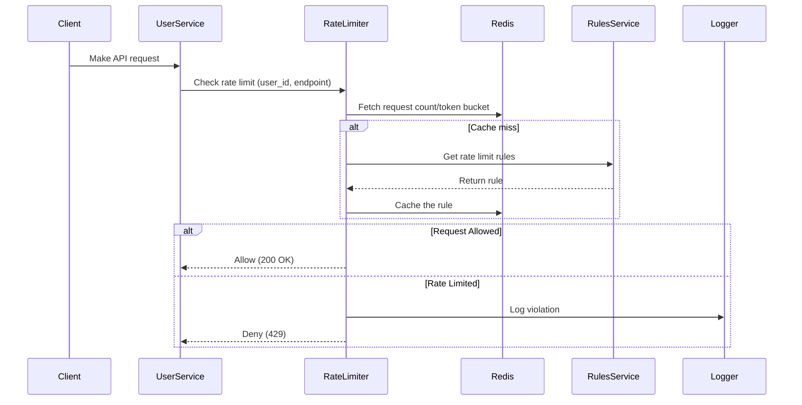
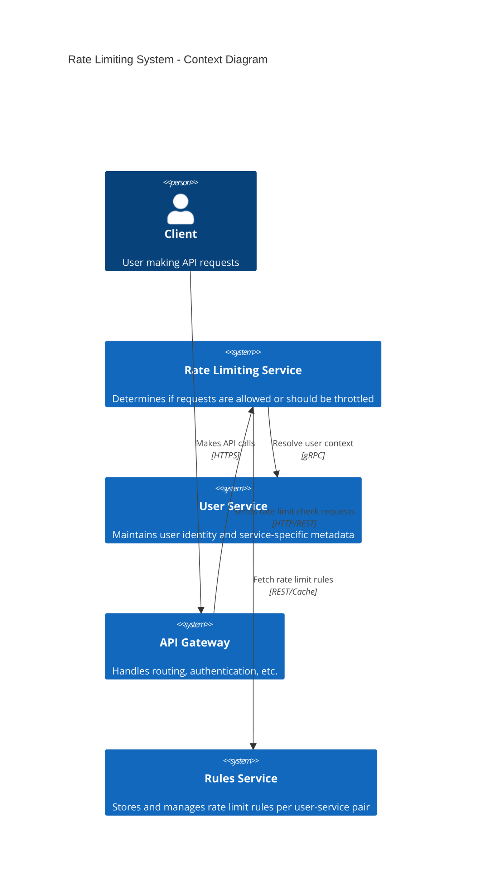
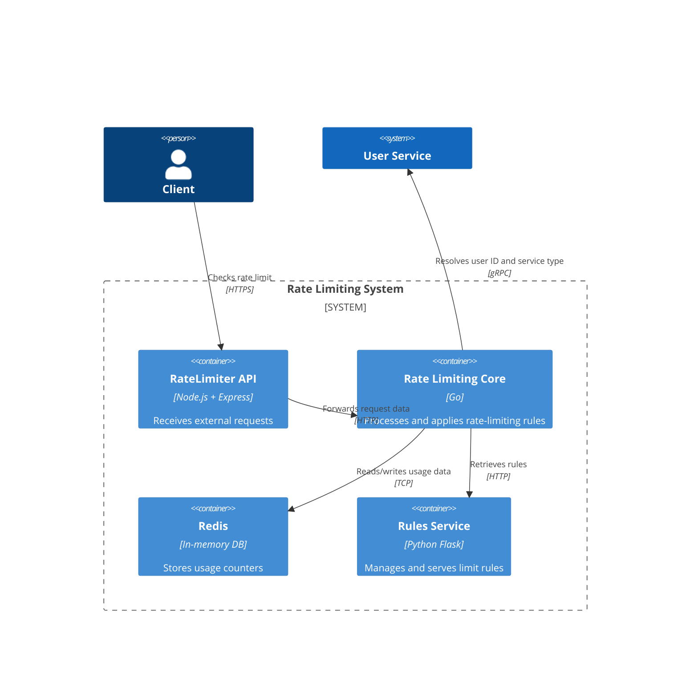

# Rate Limiting Service

## Overview

This project implements a scalable, efficient, and simple rate-limiting microservice designed to prevent abuse, ensure fair usage, and maintain API stability during traffic spikes. The rate limiter acts as a shared service for all "user services," which are client-facing and independently rate-limited.

---

## Functional Requirements

- Each *user service* is independently rate-limited.
- Requests include a `user_id` and a `user_service_id`. The combination is used to apply the correct limits.
- Multiple endpoints in a user service may have different limits.
- Limits are simple: e.g., **max 10 requests per 10 seconds**, or **60-second windows**.
- Requests over the threshold receive a **429 Too Many Requests** response.
- A rate-limited log is maintained for manual review and analytics (required).
- Users can query a log endpoint for rate-limited requestors and corresponding timestamps.
- Logging of all requests may be discussed; for now, assume it's required.
- Configuration of rate limits is performed only internally (manual input), not exposed to external users.

---

## Non-Functional Requirements

- **Scalability:** Must handle billions of daily rate-limit checks across distributed services.
- **Performance:** Low-latency decision-making is critical (in-memory cache or Redis).
- **Simplicity:** Easy to use, deploy, and debug.
- **Security & Privacy:** Frontend service mesh handles auth and basic security checks.
- **Availability:** Rate limiting is not mission-critical, so high availability and failover can be relaxed.
- **Consistency:** Should be eventually consistent across distributed instances; absolute precision is not mandatory.

---

## Do We Really Need a Rate Limiting Service?

### Alternatives Considered

- **Auto-scaling services**: Helps absorb traffic spikes but doesn't control abuse.
- **Load balancers**: Distribute load, but cannot enforce per-user or per-endpoint limits.
- **API Gateways**: Can work for small cases, but lack flexibility and deep analytics.

### Why Rate Limiting Still Makes Sense

- Fine-grained control per user and endpoint.
- Service-level configurability and flexibility.
- Centralized control and logging for analytics and attack mitigation.
- Cost-effective protection against DDoS or burst abuse.

---

## Entity & Data Model Design

Each incoming request includes:
- `user_id`: Identifies the external user or client.
- `user_service_id`: Identifies the consuming service.
- `endpoint`: API path or method being accessed.

Together, a key like:  
`user_service_id::user_id::endpoint`  
is used to manage limits independently.

Rate limit rules are stored in a configuration service and cached:
```json
{
  "user_service_id::endpoint": {
    "limit": 10,
    "interval": 10  // in seconds
  }
}

```

# Component Services

## 1. Rate Limiter Backend
- **REST API exposed to user services**
- Implements core rate-limiting logic
- Queries cache/store to enforce limits
- Logs rate-limited requestors

## 2. Rules Service
- Stores configuration for rate limits per user service/endpoint
- Only modifiable by internal admin tools
- Supports hot reloads or periodic refresh

## 3. Request Log Service
- Persists rate-limited requestor events
- May support querying (e.g., filter by time/user)
- May use tiered logging (e.g., log only violations)

---

# Databases & Storage

| Component        | Storage Used               | Purpose                         |
|------------------|----------------------------|---------------------------------|
| **Rate State**   | Redis                      | Token counters / sliding window |
| **Rules Store**  | Redis / DB                 | Rate limit configs              |
| **Request Logs** | PostgreSQL / ClickHouse    | Analytics, querying             |

---

# Implementation Models: Backend vs Middleware

| Option         | Pros                              | Cons                                |
|----------------|-----------------------------------|-------------------------------------|
| **Middleware** | Integrated into user services     | Less reusable, duplicate logic per service |
| **Backend Service** | Centralized, reusable, language-agnostic | Slightly more network latency      |
| **API Gateway** | Easy if using commercial gateways | Limited algorithm flexibility, vendor lock-in |

**Our choice**: Backend Service for central control, reusability, and flexibility.

---

# Rate Limiting Algorithms

| Algorithm              | Burst Support | Accuracy | Memory Use | Complexity | Notes                                                        |
|------------------------|---------------|----------|------------|------------|--------------------------------------------------------------|
| **Fixed Window Counter**| ❌ No         | ⚠️ Low   | ✅ Low     | ✅ Simple  | May double-allow at window edges                             |
| **Sliding Window Log**  | ✅ Yes        | ✅ High  | ❌ High    | ⚠️ Medium | Logs timestamps; ideal for small-scale precision             |
| **Sliding Window Counter**| ✅ Yes      | ✅ Medium| ⚠️ Medium | ⚠️ Medium | Balanced accuracy, uses multiple small buckets               |
| **Token Bucket**        | ✅ Yes        | ✅ High  | ✅ Low     | ⚠️ Medium | Most popular; allows burst, smooth refill                    |
| **Leaky Bucket**        | ❌ No         | ✅ High  | ✅ Low     | ❌ High   | Best for smoothing output rate; strict throttle              |

**Selected Algorithm**: **Token Bucket**
- Each request consumes a token.
- Tokens refill at a fixed rate.
- Redis used to track token state with TTL and Lua scripts for atomic updates.


# Data Flow



# C4 model diagramm



