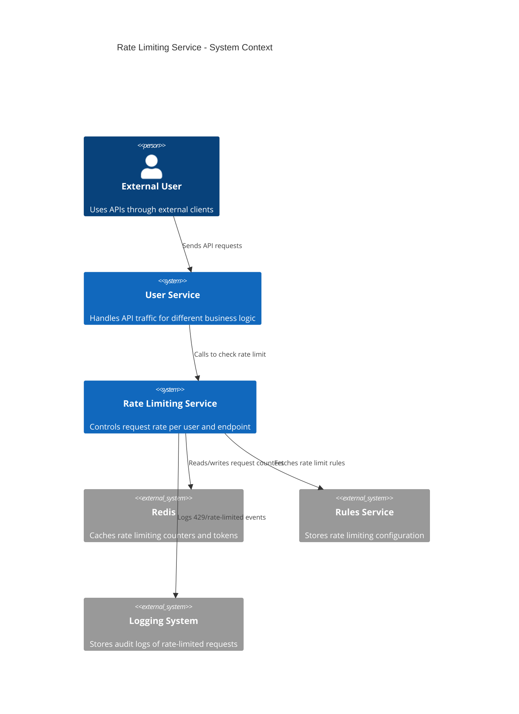
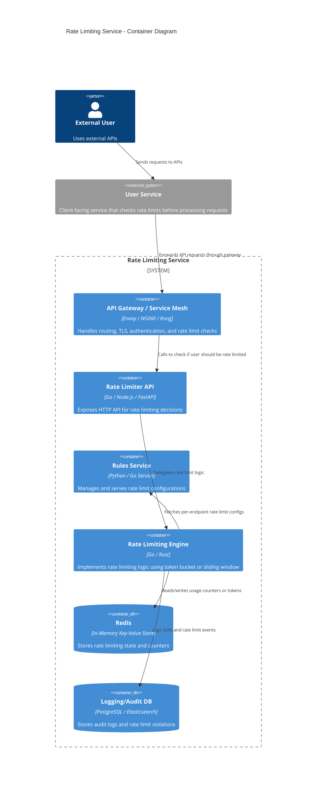

```mermaid
C4Context
title Rate Limiting Service - System Context

Person(ExternalUser, "External User", "Uses APIs through external clients")

System(UserService, "User Service", "Handles API traffic for different business logic")

System(RateLimiter, "Rate Limiting Service", "Controls request rate per user and endpoint")

System_Ext(RedisStore, "Redis", "Caches rate limiting counters and tokens")

System_Ext(RulesService, "Rules Service", "Stores rate limiting configuration")

System_Ext(LoggingSystem, "Logging System", "Stores audit logs of rate-limited requests")


Rel(ExternalUser, UserService, "Sends API requests")
Rel(UserService, RateLimiter, "Calls to check rate limit")
Rel(RateLimiter, RedisStore, "Reads/writes request counters")
Rel(RateLimiter, RulesService, "Fetches rate limit rules")
Rel(RateLimiter, LoggingSystem, "Logs 429/rate-limited events")


```

```mermaid 

C4Container
title Rate Limiting Service - Container Diagram

Person(ExternalUser, "External User", "Uses external APIs")

System_Boundary(rateLimiterSystem, "Rate Limiting Service") {

  Container(ApiGateway, "API Gateway / Service Mesh", "Envoy / NGINX / Kong", "Handles routing, TLS, authentication, and rate limit checks")

  Container(RateLimiterAPI, "Rate Limiter API", "Go / Node.js / FastAPI", "Exposes HTTP API for rate limiting decisions")

  Container(RulesService, "Rules Service", "Python / Go Service", "Manages and serves rate limit configurations")

  Container(RateLimiterCore, "Rate Limiting Engine", "Go / Rust", "Implements rate limiting logic using token bucket or sliding window")

  ContainerDb(RedisStore, "Redis", "In-Memory Key-Value Store", "Stores rate limiting state and counters")

  ContainerDb(LoggingStore, "Logging/Audit DB", "PostgreSQL / Elasticsearch", "Stores audit logs and rate limit violations")
}

System_Ext(UserService, "User Service", "Client-facing service that checks rate limits before processing requests")

Rel(ExternalUser, UserService, "Sends requests to APIs")

Rel(UserService, ApiGateway, "Forwards API requests through gateway")

Rel(ApiGateway, RateLimiterAPI, "Calls to check if user should be rate limited")

Rel(RateLimiterAPI, RateLimiterCore, "Delegates rate limit logic")

Rel(RateLimiterCore, RedisStore, "Reads/writes usage counters or tokens")

Rel(RateLimiterCore, RulesService, "Fetches per-endpoint rate limit configs")

Rel(RateLimiterCore, LoggingStore, "Logs 429s and rate limit events")

```