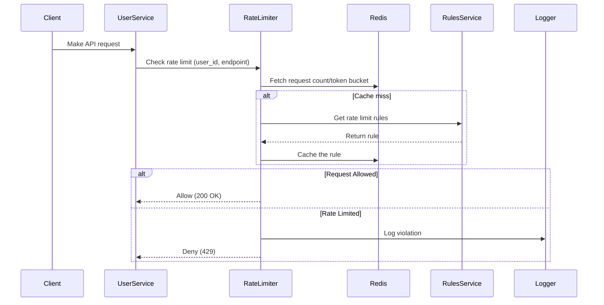
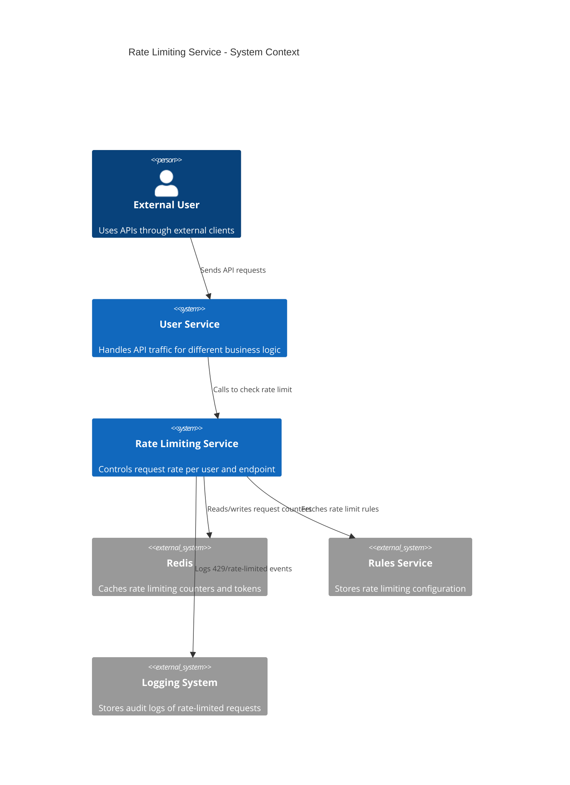
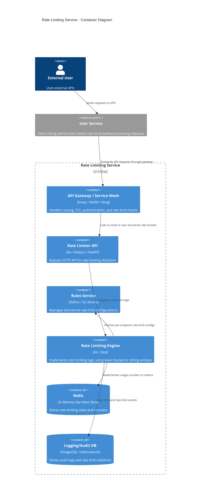

# 🧩 Component Services

## 1. Rate Limiter Backend
- **REST API exposed to user services**
- Implements core rate-limiting logic
- Queries cache/store to enforce limits
- Logs rate-limited requestors

## 2. Rules Service
- Stores configuration for rate limits per user service/endpoint
- Only modifiable by internal admin tools
- Supports hot reloads or periodic refresh

## 3. Request Log Service
- Persists rate-limited requestor events
- May support querying (e.g., filter by time/user)
- May use tiered logging (e.g., log only violations)

---

# 🗃️ Databases & Storage

| Component        | Storage Used               | Purpose                         |
|------------------|----------------------------|---------------------------------|
| **Rate State**   | Redis                      | Token counters / sliding window |
| **Rules Store**  | Redis / DB                 | Rate limit configs              |
| **Request Logs** | PostgreSQL / ClickHouse    | Analytics, querying             |

---

# 🧰 Implementation Models: Backend vs Middleware

| Option         | Pros                              | Cons                                |
|----------------|-----------------------------------|-------------------------------------|
| **Middleware** | Integrated into user services     | Less reusable, duplicate logic per service |
| **Backend Service** | Centralized, reusable, language-agnostic | Slightly more network latency      |
| **API Gateway** | Easy if using commercial gateways | Limited algorithm flexibility, vendor lock-in |

**Our choice**: Backend Service for central control, reusability, and flexibility.

---

# 🧮 Rate Limiting Algorithms

| Algorithm              | Burst Support | Accuracy | Memory Use | Complexity | Notes                                                        |
|------------------------|---------------|----------|------------|------------|--------------------------------------------------------------|
| **Fixed Window Counter**| ❌ No         | ⚠️ Low   | ✅ Low     | ✅ Simple  | May double-allow at window edges                             |
| **Sliding Window Log**  | ✅ Yes        | ✅ High  | ❌ High    | ⚠️ Medium | Logs timestamps; ideal for small-scale precision             |
| **Sliding Window Counter**| ✅ Yes      | ✅ Medium| ⚠️ Medium | ⚠️ Medium | Balanced accuracy, uses multiple small buckets               |
| **Token Bucket**        | ✅ Yes        | ✅ High  | ✅ Low     | ⚠️ Medium | Most popular; allows burst, smooth refill                    |
| **Leaky Bucket**        | ❌ No         | ✅ High  | ✅ Low     | ❌ High   | Best for smoothing output rate; strict throttle              |

**Selected Algorithm**: **Token Bucket**
- Each request consumes a token.
- Tokens refill at a fixed rate.
- Redis used to track token state with TTL and Lua scripts for atomic updates.

# 🔁 Data Flow

